# VRodos Compiler Architecture

## Scope

The compiler remains a transactional WordPress/A-Frame pipeline. Target-specific Web derivatives may be prepared asynchronously before rendering, but no client or stable link changes until every required artifact is ready. The compiler preserves the current `Master_Client_{scene}.html`, `Simple_Client_{scene}.html`, and `index_{scene}.html` naming rules, existing response URL fields, `scene-settings`, compatibility globals, decoder configuration, and lazy runtime chunks. Generated clients live under `wp-content/uploads/vrodos/published/projects/{project_id}/clients/`; content-addressed public media lives beside them under `media/`.

New compiler work should use this flow:

```mermaid
flowchart LR
    Request["Authenticated compile POST"] --> Typed["VRodos_Compile_Request"]
    Typed --> Context["Validated project + scene context"]
    Context --> Resolver["VRodos_Compiler_Plan_Resolver"]
    Resolver --> Profiles["Target Web derivative preflight"]
    Profiles --> Targets["VRodos_Runtime_Target_Plan[]"]
    Targets --> Render["VRodos_Compiler_Target_Assembler"]
    Render --> Transaction["Project lock + staging + rollback"]
    Transaction --> Links["VRodos_Compiler_Link_Publisher"]
    Links --> Runtime["Optional network runtime startup"]
```



`VRodos_Compiler_Manager::compile(VRodos_Compile_Request)` is the only compiler entrypoint. AJAX callers retain their existing public response fields through `VRodos_Compile_Result::to_public_payload()`. Runtime URL construction and local/public URL normalization belong to `VRodos_Runtime_URL_Resolver` and `VRodos_URL_Normalizer`, not to the compiler.

## Request and plan ownership

`VRodos_Compile_Request` owns project-build inputs:

- project ID and selected scene ID
- ordered scene IDs
- `runtimeMode`
- `vrRuntimeProfile`
- `showPawnPositions`

The runtime mode and VR profile apply to every scene in one project build. Render quality, atmosphere, post-processing, background, hover behavior, and other artistic choices remain scene-specific. Scene ordering must not change project target policy.

`VRodos_Compiler_Plan_Resolver` clones source scene JSON, normalizes every entity once, applies project policy to the clone, resolves effective settings, derives capabilities, asks the manifest planner for ordered chunks, and returns immutable scene, target, and project plans. Source post metadata is not mutated.

For the desktop runtime target, scene metadata stores schema v2 `desktopPerformanceProfiles`: `buildMode` (`custom` or `adaptive`), `activeTab`, and the bounded performance overrides plus preset baselines for Low/Medium/High. Ordinary scene metadata remains the canonical Custom/shared source. `assets/desktop-performance-profiles.json` is the shared PHP/browser preset and constraint source. Custom builds plan one Web High capability/chunk set; adaptive builds plan Web Low, Medium, and High. Headset and PC-rendered-VR use the derivative family but do not consume this desktop settings contract.

## Settings and capabilities

`assets/runtime-settings-contract.json` schema 2 is the shared default/type/enum/wire contract. Every ordinary setting declares its generated `scene-settings` wire key and boolean format. The generated browser contract drives editor defaults; PHP uses the same contract for editor hydration, compile normalization, and wire serialization. A small derived-policy layer still owns project target, camera, fog, celestial presets, renderer policy, and effective post-FX.

Effective setting precedence is:

1. contract default;
2. normalized scene metadata;
3. allowlisted legacy `composite_params` value.

An idempotent batched migration moves allowlisted legacy `composite_params`, atmosphere fields, and page-template paths into canonical metadata. Canonical fields win. Unsupported overlay entries are reported and discarded because they were never part of the runtime contract; malformed scene JSON remains pending and keeps the zero-remaining preflight open. Legacy readers deactivate only after that preflight succeeds.

Capabilities are derived once after effective scene policy is known. `activationCapabilities` in `assets/runtime-build-manifest.json` schema 2 maps capabilities to lazy chunks. The script planner adds baseline chunks, validates activation coverage, resolves dependencies, and preserves manifest order. Invalid paths, missing files, duplicate ordering, dependency cycles, undeclared dependencies, and uncovered capabilities are compile errors.

When `vrodos_asset3d_glb` becomes active after a normal upload or Immerse import, `VRodos_Asset_Optimization_Manager` publishes the source immediately and queues one immutable `web-high` job. High completion queues `web-medium`, and Medium completion queues `web-low`; every import, status, dashboard, batch, and Build trigger joins the same source-hash-and-recipe job instead of duplicating work. Before target rendering, Build verifies its required derivative: Desktop Custom/High and PC-rendered-VR need `web-high`, Desktop Medium needs `web-medium`, and Desktop Low plus standalone headset need `web-low`. Pending work returns HTTP `202 Accepted` with the build phase, overall percentage, ready/total counts, and per-asset/profile optimizer steps; HTTP `409` is reserved for cancellation or a real state conflict. A source over 100 MiB cannot be published when its required derivative failed or is unavailable; smaller sources may fall back with a compile warning, while the prior publication remains intact. All Web profiles require KTX-Software, cap textures at 4096/2048/1024px, use KTX2 textures and safe Draco, and keep source uploads unchanged. Web High preserves geometry. Collision/navigation assets and GLBs containing skins or morph targets bypass simplification in every profile.

Production should invoke due WordPress cron events at least once per minute so post-import derivative chaining continues without browser traffic. Request-driven WP-Cron remains functional and Build/status recovery joins or repairs the same immutable jobs, but it does not provide deterministic unattended queue latency. Hosting integrations must verify the scheduler separately from the Node/KTX optimizer preflight.

The version-4 CPU recipe uses UASTC level 2 with Zstd 9 for normal/data textures and ETC1S quality 128 (96 for Low) for color/emissive textures. On the local 413.7 MiB, three-8K-texture regression asset, Zstd 9 was the fastest candidate satisfying the 64 MiB and 80% reduction gates: 31.23 seconds and 38.34 MiB, compared with 32.65 seconds/37.95 MiB for level 12 and 40.36 seconds/36.40 MiB for level 18. With the final pinned glTF-Transform 4.5.0, Sharp 0.35.4, and libvips 8.18.6 toolchain, the protected-geometry pipeline generated High in 28.24 seconds versus 42.11 seconds for the previous CLI pipeline (32.9% faster), and generated High, Medium, and Low serially in 48.22 seconds versus 84.95 seconds (43.2% faster). High was 38.34 MiB (90.7% smaller), peak RSS was about 1.81 GiB, and every output retained the source's 2,300,007 triangles and 1,150,181 vertices. These figures are same-machine recipe comparisons, not production latency guarantees.

Pending compile responses are a bare JSON payload, not a WordPress error envelope:

```json
{
  "status": "pending",
  "pending": true,
  "phase": {
    "key": "asset-optimization",
    "step": 2,
    "totalSteps": 3,
    "label": "Preparing desktop assets"
  },
  "ready": 1,
  "total": 3,
  "percent": 42,
  "profiles": [
    {
      "assetId": 90,
      "assetLabel": "Ancient Ruined Template",
      "profile": "web-medium",
      "profileLabel": "Medium",
      "status": "running",
      "step": 6,
      "totalSteps": 9,
      "percent": 67,
      "message": "Resizing textures",
      "updatedAt": "2026-09-06T11:54:00.000Z"
    }
  ],
  "retryAfterMs": 3000
}
```

Clients continue polling at `retryAfterMs` until a final HTTP `200` compile payload, user cancellation, an actual error response, or 15 minutes without meaningful optimizer progress. The dialog warns after two minutes without progress and allows the user to stop waiting without discarding reusable derivative work. Matching `queued` records repair missing cron events, while `running` records with no metadata or progress-file activity for 12 minutes are returned to the queue. Profile status is one of `queued`, `running`, `ready`, or `failed`. Optimizer step totals describe work units, not a time estimate.

## Artifact and target policy

All HTML is rendered into `VRodos_Compile_Artifact` values before publication. `VRodos_Compiler_Artifact_Transaction` acquires a project-specific filesystem lock, writes same-filesystem staging files, reads the per-project artifact inventory, backs up replacements and stale targets, publishes the new set and inventory, and restores replacements, stale files, and the prior inventory if publication fails.

Each `VRodos_Runtime_Target_Plan` declares its template, filename, scene, runtime mode, capabilities, and ordered chunks. Current target policy remains:

- Master for every scene;
- Simple and Index only for networked, non-VRExpo projects;
- dedicated VRExpo/standard player rigs and explicit networking fragments through `VRodos_Compiler_Target_Renderer`.

`VRodos_Compiler_Target_Assembler` is the single target-assembly path. It consumes the immutable target plan and delegates shared DOM, settings, decoder, entity, and diagnostics work to `VRodos_Compiler_Runtime_Page_Builder`; the compiler manager only sequences targets and publishes the captured artifact set.

Adaptive Desktop Master output embeds a small schema v2 manifest. Its capability bootstrap runs before A-Frame, selects Low/Medium/High using query override, saved preference, or automatic hardware policy, and writes only the selected A-Frame/runtime script set. Profile GLB URLs remain inert data attributes until `vrodos-scene-loader` activates the selected URL. After a settled performance sample, an adaptive client can recommend a different tier and reloads only when the player accepts it. Custom-only Master output contains no capability bootstrap or adaptive query/recommendation path and renders its single derivative directly. Simple remains a lean companion and renders Custom or the adaptive High slot directly.

The link publisher owns URL construction. Network runtime startup happens only after artifact commit; startup failure produces a warning and does not roll back valid HTML.

Public integrations must consume `MasterClient` or `CurrentSceneMasterClient` from the compile result instead of reconstructing the former plugin-local `runtime/build` URL. A same-installation integration that resolves an already-published scene later may use `VRodos_Storage_Manager::published_project_url()` after validating the scene-to-project taxonomy relationship. Theme-owned demo exports are independent snapshots and must be refreshed explicitly when their embedded runtime packages change.

## Entity rendering

`VRodos_Compiler_Entity_Policy` normalizes the already isolated compile-plan entity, preserves supplied UUIDs, derives deterministic fallback IDs, applies the canonical category alias map, and selects renderer families. Shared transforms, asset resolution, materials, shadows, collision decoration, and diagnostics stay outside category-specific branches.

The runtime version manifest is also schema 2. It is the strict provenance contract for A-Frame, Three, decoders, PMNDRS, Takram, BVH, and locally generated browser libraries. Its versions are checked against `package-lock.json`, and every declared local artifact must exist. Validation failures are compile errors and administrator diagnostics; there is no CDN/default fallback.

The canonical light categories are `light-sun`, `light-spot`, `light-lamp`, and `light-ambient`. CamelCase, lowercase, and hyphenated aliases normalize to those values.

## Security boundary

The compile action is a POST-only editor flow with a localized nonce, per-project/per-scene `edit_post` checks, post-type validation, and project taxonomy membership validation. Failures use coded JSON error payloads.

Compiled virtual-production pages contain only the same-origin WordPress AJAX URL and project ID. They never receive a MediaVerse node URL or bearer token. A read-only authenticated session action issues a short-lived upload nonce; a multipart action validates access, size, extension, MIME, and project type before proxying through the current user's server-side credential. Cross-origin and logged-out clients fail closed with a user-facing authentication message.

## Verification

Run `node scripts/run-compiler-runtime-tests.mjs` with PHP 8.3. The runner checks `PHP_BINARY`, `PHP`, and `PATH` in that order; on Windows it also discovers versioned LocalWP and WampServer PHP installations. The suite covers manifest/capability order, cycles and unsafe paths, DOM target transformations, target uniformity across scenes, settings precedence, light aliases, deterministic IDs, source isolation, rig strategies, unknown-category diagnostics, stale artifact cleanup, and artifact rollback.

After compiler/runtime source changes, also run `node --check`, PHP syntax checks, `npm run lint`, the direct runtime build fallback when necessary, and `git diff --check`. Recompile representative single-player, networked, desktop, and headset scenes before deployment.

## Deferred boundaries

Do not mix the next initiatives into compiler policy cleanup: rendering-quality/atmosphere/shadow ownership, navigation/collision/XR-ray ownership, asset-import job stages, async build queues, or service bootstrap registration. Treat those as separate migrations after compiler fixture parity is stable.
