# VRodos Compiler Architecture

## Scope

The compiler remains a synchronous WordPress/A-Frame pipeline. It preserves the current `Master_Client_{scene}.html`, `Simple_Client_{scene}.html`, and `index_{scene}.html` naming rules, existing response URL fields, `scene-settings`, compatibility globals, decoder configuration, and lazy runtime chunks.

New compiler work should use this flow:

```mermaid
flowchart LR
    Request["Authenticated compile POST"] --> Typed["VRodos_Compile_Request"]
    Typed --> Context["Validated project + scene context"]
    Context --> Resolver["VRodos_Compiler_Plan_Resolver"]
    Resolver --> Targets["VRodos_Runtime_Target_Plan[]"]
    Targets --> Render["VRodos_Compiler_Target_Assembler"]
    Render --> Transaction["Project lock + staging + rollback"]
    Transaction --> Links["VRodos_Compiler_Link_Publisher"]
    Links --> Runtime["Optional network runtime startup"]
```

`VRodos_Compiler_Manager::compile(VRodos_Compile_Request)` is the only compiler entrypoint. AJAX callers retain their existing public response fields through `VRodos_Compile_Result::to_public_payload()`. Runtime URL construction and local/public URL normalization belong to `VRodos_Runtime_URL_Resolver` and `VRodos_URL_Normalizer`, not to the compiler.

## Request and plan ownership

`VRodos_Compile_Request` owns project-build inputs:

- project ID and selected scene ID
- ordered scene IDs
- `runtimeMode`
- `vrRuntimeProfile`
- `showPawnPositions`

The runtime mode and VR profile apply to every scene in one project build. Render quality, atmosphere, post-processing, background, hover behavior, and other artistic choices remain scene-specific. Scene ordering must not change project target policy.

`VRodos_Compiler_Plan_Resolver` clones source scene JSON, normalizes every entity once, applies project policy to the clone, resolves effective settings, derives capabilities, asks the manifest planner for ordered chunks, and returns immutable scene, target, and project plans. Source post metadata is not mutated.

## Settings and capabilities

`assets/runtime-settings-contract.json` schema 2 is the shared default/type/enum/wire contract. Every ordinary setting declares its generated `scene-settings` wire key and boolean format. The generated browser contract drives editor defaults; PHP uses the same contract for editor hydration, compile normalization, and wire serialization. A small derived-policy layer still owns project target, camera, fog, celestial presets, renderer policy, and effective post-FX.

Effective setting precedence is:

1. contract default;
2. normalized scene metadata;
3. allowlisted legacy `composite_params` value.

An idempotent batched migration moves allowlisted legacy `composite_params`, atmosphere fields, and page-template paths into canonical metadata. Canonical fields win. Unsupported overlay entries are reported and discarded because they were never part of the runtime contract; malformed scene JSON remains pending and keeps the zero-remaining preflight open. Legacy readers deactivate only after that preflight succeeds.

Capabilities are derived once after effective scene policy is known. `activationCapabilities` in `assets/runtime-build-manifest.json` schema 2 maps capabilities to lazy chunks. The script planner adds baseline chunks, validates activation coverage, resolves dependencies, and preserves manifest order. Invalid paths, missing files, duplicate ordering, dependency cycles, undeclared dependencies, and uncovered capabilities are compile errors.

## Artifact and target policy

All HTML is rendered into `VRodos_Compile_Artifact` values before publication. `VRodos_Compiler_Artifact_Transaction` acquires a project-specific filesystem lock, writes same-filesystem staging files, reads the per-project artifact inventory, backs up replacements and stale targets, publishes the new set and inventory, and restores replacements, stale files, and the prior inventory if publication fails.

Each `VRodos_Runtime_Target_Plan` declares its template, filename, scene, runtime mode, capabilities, and ordered chunks. Current target policy remains:

- Master for every scene;
- Simple and Index only for networked, non-VRExpo projects;
- dedicated VRExpo/standard player rigs and explicit networking fragments through `VRodos_Compiler_Target_Renderer`.

`VRodos_Compiler_Target_Assembler` is the single target-assembly path. It consumes the immutable target plan and delegates shared DOM, settings, decoder, entity, and diagnostics work to `VRodos_Compiler_Runtime_Page_Builder`; the compiler manager only sequences targets and publishes the captured artifact set.

The link publisher owns URL construction. Network runtime startup happens only after artifact commit; startup failure produces a warning and does not roll back valid HTML.

## Entity rendering

`VRodos_Compiler_Entity_Policy` normalizes the already isolated compile-plan entity, preserves supplied UUIDs, derives deterministic fallback IDs, applies the canonical category alias map, and selects renderer families. Shared transforms, asset resolution, materials, shadows, collision decoration, and diagnostics stay outside category-specific branches.

The runtime version manifest is also schema 2. It is the strict provenance contract for A-Frame, Three, decoders, PMNDRS, Takram, BVH, and locally generated browser libraries. Its versions are checked against `package-lock.json`, and every declared local artifact must exist. Validation failures are compile errors and administrator diagnostics; there is no CDN/default fallback.

The canonical light categories are `light-sun`, `light-spot`, `light-lamp`, and `light-ambient`. CamelCase, lowercase, and hyphenated aliases normalize to those values.

## Security boundary

The compile action is a POST-only editor flow with a localized nonce, per-project/per-scene `edit_post` checks, post-type validation, and project taxonomy membership validation. Failures use coded JSON error payloads.

Compiled virtual-production pages contain only the same-origin WordPress AJAX URL and project ID. They never receive a MediaVerse node URL or bearer token. A read-only authenticated session action issues a short-lived upload nonce; a multipart action validates access, size, extension, MIME, and project type before proxying through the current user's server-side credential. Cross-origin and logged-out clients fail closed with a user-facing authentication message.

## Verification

Run `node scripts/run-compiler-runtime-tests.mjs` with `PHP_BINARY` set to PHP 8.3 when PHP is not available on `PATH`. The suite covers manifest/capability order, cycles and unsafe paths, DOM target transformations, target uniformity across scenes, settings precedence, light aliases, deterministic IDs, source isolation, rig strategies, unknown-category diagnostics, stale artifact cleanup, and artifact rollback.

After compiler/runtime source changes, also run `node --check`, PHP syntax checks, `npm run lint`, the direct runtime build fallback when necessary, and `git diff --check`. Recompile representative single-player, networked, desktop, and headset scenes before deployment.

## Deferred boundaries

Do not mix the next initiatives into compiler policy cleanup: rendering-quality/atmosphere/shadow ownership, navigation/collision/XR-ray ownership, asset-import job stages, async build queues, or service bootstrap registration. Treat those as separate migrations after compiler fixture parity is stable.
