# VRodos Compiler Architecture

## Scope

The compiler remains a synchronous WordPress/A-Frame pipeline. It preserves the current `Master_Client_{scene}.html`, `Simple_Client_{scene}.html`, and `index_{scene}.html` naming rules, existing response URL fields, `scene-settings`, compatibility globals, decoder configuration, and lazy runtime chunks.

New compiler work should use this flow:

```mermaid
flowchart LR
    Request["Authenticated compile POST"] --> Typed["VRodos_Compile_Request"]
    Typed --> Context["Validated project + scene context"]
    Context --> Resolver["VRodos_Compiler_Plan_Resolver"]
    Resolver --> ScenePlans["VRodos_Scene_Compile_Plan[]"]
    ScenePlans --> Render["Render all artifacts in memory"]
    Render --> Transaction["Project lock + staging + rollback"]
    Transaction --> Links["VRodos_Compiler_Link_Publisher"]
    Links --> Runtime["Optional network runtime startup"]
```

`VRodos_Compiler_Manager::compile_aframe()` is a compatibility facade. It constructs a typed request, delegates to `compile()`, and projects the typed result back to the legacy JSON payload.

## Request and plan ownership

`VRodos_Compile_Request` owns project-build inputs:

- project ID and selected scene ID
- ordered scene IDs
- `runtimeMode`
- `vrRuntimeProfile`
- `showPawnPositions`

The runtime mode and VR profile apply to every scene in one project build. Render quality, atmosphere, post-processing, background, hover behavior, and other artistic choices remain scene-specific. Scene ordering must not change project target policy.

`VRodos_Compiler_Plan_Resolver` clones source scene JSON, applies project policy to the clone, resolves effective settings, derives capabilities, asks the manifest planner for ordered chunks, and returns immutable scene/project plans. Source post metadata is not mutated.

## Settings and capabilities

`assets/runtime-settings-contract.json` is the shared default/type/enum contract. The generated browser contract drives editor defaults; PHP uses the same contract for editor hydration, compile normalization, and `scene-settings` hydration. Existing derived/legacy editor rules refine that baseline during the compatibility stage.

Effective setting precedence is:

1. contract default;
2. normalized scene metadata;
3. allowlisted legacy `composite_params` value.

Legacy overlays cannot replace project target or derived fields. Unknown/malformed legacy keys become compile diagnostics and are not serialized.

Capabilities are derived after effective scene policy is known. `activationCapabilities` in `assets/runtime-build-manifest.json` maps capabilities to lazy chunks. The script planner adds baseline chunks, validates activation coverage, resolves dependencies, and preserves manifest order.

## Artifact and target policy

All HTML is rendered into `VRodos_Compile_Artifact` values before publication. `VRodos_Compiler_Artifact_Transaction` acquires a project-specific filesystem lock, writes same-filesystem staging files, backs up current targets, renames the staged set into place, and restores backups if publication fails.

Current target policy remains:

- Master for every scene;
- Simple and Index only for networked, non-VRExpo projects;
- dedicated VRExpo/standard player rigs and explicit networking fragments through `VRodos_Compiler_Target_Renderer`.

The link publisher owns URL construction. Network runtime startup happens only after artifact commit; startup failure produces a warning and does not roll back valid HTML.

## Entity rendering

`VRodos_Compiler_Entity_Policy` deep-clones objects, preserves supplied UUIDs, derives deterministic fallback IDs, applies the canonical category alias map, and selects renderer families. Shared transforms, asset resolution, materials, shadows, collision decoration, and diagnostics stay outside category-specific branches.

The canonical light categories are `light-sun`, `light-spot`, `light-lamp`, and `light-ambient`. CamelCase, lowercase, and hyphenated aliases normalize to those values.

## Security boundary

The compile action is a POST-only editor flow with a localized nonce, per-project/per-scene `edit_post` checks, post-type validation, and project taxonomy membership validation. Failures use coded JSON error payloads.

Compiled virtual-production pages contain only the same-origin WordPress AJAX URL and project ID. They never receive a MediaVerse node URL or bearer token. A read-only authenticated session action issues a short-lived upload nonce; a multipart action validates access, size, extension, MIME, and project type before proxying through the current user's server-side credential. Cross-origin and logged-out clients fail closed with a user-facing authentication message.

## Verification

Run `node scripts/run-compiler-runtime-tests.mjs` with `PHP_BINARY` set to PHP 8.3 when PHP is not available on `PATH`. The suite covers manifest/capability order, DOM target transformations, target uniformity across scenes, settings precedence, light aliases, deterministic IDs, source immutability, rig strategies, unknown-category diagnostics, and artifact rollback.

After compiler/runtime source changes, also run `node --check`, PHP syntax checks, `npm run lint`, the direct runtime build fallback when necessary, and `git diff --check`. Recompile representative single-player, networked, desktop, and headset scenes before deployment.

## Deferred boundaries

Do not mix the next initiatives into compiler policy cleanup: rendering-quality/atmosphere/shadow ownership, navigation/collision/XR-ray ownership, asset-import job stages, async build queues, or service bootstrap registration. Treat those as separate migrations after compiler fixture parity is stable.
