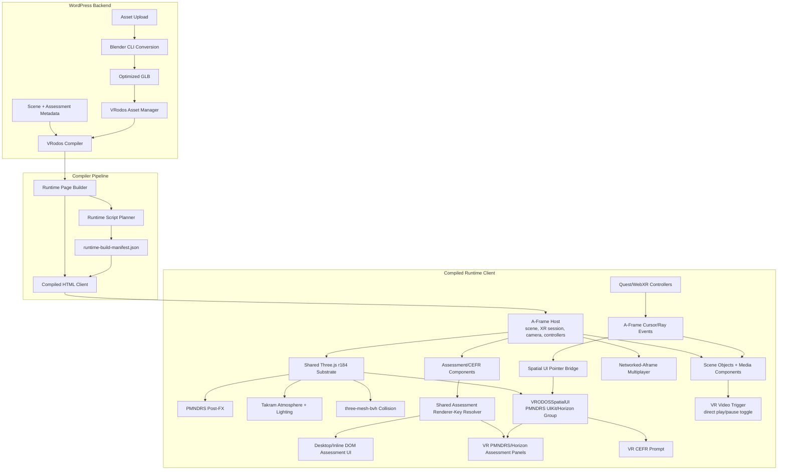

# VRodos Compiled Scene Framework Integration

## Executive Summary

VRodos compiled scenes make [A-Frame](https://github.com/aframevr/aframe), [Three.js](https://github.com/mrdoob/three.js), [PMNDRS](https://github.com/pmndrs/postprocessing), [Takram](https://github.com/takram-design-engineering/three-geospatial), [three-mesh-bvh](https://github.com/gkjohnson/three-mesh-bvh), and [Networked-Aframe](https://github.com/networked-aframe/networked-aframe) work together by avoiding the usual integration traps:

- one compiled `<a-scene>` is the runtime container;
- one shared Three.js runtime is the rendering substrate;
- `scene-settings` is the compatibility contract between compiler output and runtime behavior;
- `assets/runtime-build-manifest.json` controls script order, dependencies, and lazy feature loading;
- focused A-Frame components own lifecycle hooks and delegate to VRodos helpers;
- immersive dialog UI is a PMNDRS/Horizon island mounted in the same A-Frame/Three scene, not a second renderer and not A-Frame UI primitives;
- optional systems such as PMNDRS, Takram atmosphere, BVH collision, FPS tooling, and networking load only when scene metadata requests them.

The result is not several frameworks fighting for the frame. The compiled client is a single A-Frame scene with a carefully planned set of helpers attached to the same renderer, scene graph, material system, loader configuration, and lifecycle.

## The Evolution of Our Architecture

Our current state-of-the-art rendering pipeline is the result of a continuous evolution driven by specific needs. Here is the story of how our architecture came to be:

1. **A-Frame for XR Experiences**: We started with A-Frame because it provides a robust entity-component system (ECS) and excellent out-of-the-box support for immersive WebXR experiences.
2. **Post-Processing with PMNDRS**: We wanted advanced post-processing effects (like bloom, SSAO, tone mapping, and LUTs). Default Three.js and A-Frame did not support these optimally or efficiently, so we integrated **PMNDRS `postprocessing`**, a highly optimized screen-space effects engine.
3. **Dynamic Lighting with Takram**: We needed realistic, dynamic atmospheric lighting—a physical sky, sun, moon, and a day-night cycle. We integrated **Takram**, which provided these capabilities while elegantly sharing our existing Three.js renderer.
4. **Optimized Collisions with BVH**: We required physics and collisions for navigation. Full rigid-body physics engines like Rapier, or custom Three.js raycasting, were too computationally expensive for complex scenes. We adopted **`three-mesh-bvh`**, which massively accelerates static collision queries for walkable navigation.
5. **Multiplayer Collaborative Worlds**: We wanted our worlds to be collaborative and multiplayer. To achieve this, we integrated a patched **Networked-Aframe** browser runtime, backed by the first-party Node/WebRTC server (`services/vrodos-network-runtime/`). To keep single-player scenes lightweight, multiplayer is an explicit runtime mode that only loads networking components when explicitly requested by the scene's metadata.
6. **On-the-Fly Asset Conversion**: A-Frame natively supports only the `.glb` format for optimal performance. However, our users uploaded assets in various 3D formats (OBJ, FBX, etc.). To solve this, we implemented a server-side **Blender CLI pipeline** to automatically convert all uploaded 3D files into optimized `.glb` format on the fly during the upload process.

### Runtime Architecture Diagram



## 1. One Scene, One Runtime Contract

The compiler emits a real A-Frame scene, not a parallel Three app beside A-Frame. `VRodos_Compiler_Runtime_Page_Builder::apply_scene_core()` applies the scene settings, writes the root `gltf-model` decoder configuration, attaches runtime pipeline components, renders authored objects, and appends compile diagnostics.

The root scene contract has three critical parts:

- `scene-settings`: the compatibility data contract for render quality, navigation, collision mode, post-FX engine, Takram atmosphere controls, reflections, shadows, and diagnostics.
- `gltf-model`: root decoder paths for Draco, Basis/KTX2, and Meshopt so compressed GLB derivatives can load through A-Frame's GLTF loader.
- focused runtime components: `vrodos-render-profile`, `vrodos-postfx-router`, `vrodos-atmosphere`, and `vrodos-reflections`.

## 2. Version And Bundle Source Of Truth

The current compiled runtime stack is declared in the root package files and generated manifests:

- A-Frame runtime: 1.7.1 master dist commit `adf8f4e02b0499223b2c4fa93165e49b50384564`
- Three.js: `0.184.0`, revision `184`, through the `three: npm:super-three@0.184.0` root package alias
- PMNDRS `postprocessing`: `6.39.1`, exported as `window.POSTPROCESSING`
- PMNDRS spatial UI packages: `@pmndrs/uikit` `1.0.73`, `@pmndrs/uikit-horizon` `1.0.73`, `@pmndrs/uikit-lucide` `1.0.73`, and `@pmndrs/pointer-events` `6.6.29`, exported through `window.VRODOSSpatialUI` when the `spatial-ui` chunk loads
- Takram atmosphere packages: atmosphere `0.19.1`, clouds `0.7.6`, geospatial effects `0.6.4`, exported as `window.VRODOS_TAKRAM_ATMOSPHERE`
- `three-mesh-bvh`: `0.9.10`, exported as `window.VRODOS_COLLISION_BVH`

The important architectural rule is that these generated bundles must use A-Frame's `window.THREE`. Compiled scenes must not load a second Three instance beside A-Frame.

## 3. Compile-Time Selection

Runtime scripts are selected by scene metadata, not by hardcoded script tags in the template.

`VRodos_Compiler_Runtime_Script_Planner` starts with required scene components, always adds the core runtime, and then conditionally adds feature-specific chunks. For example, multiplayer is treated as an explicit runtime mode (`networked` vs `single-player`). When networking is enabled in the scene metadata, the planner injects `networked-components` into the compiled client. This ensures that single-player scenes don't pay the overhead of multiplayer components. Other conditionally loaded features include:

- FPS meter when enabled;
- `collision-bvh-vendor` when navigation mode resolves to `walkable`;
- `pmndrs-postfx` when post-FX is enabled and the engine is `pmndrs`;
- `spatial-ui` when scene metadata contains assessment surfaces, CEFR-gated Immerse assets, or video assets that need immersive controls;
- `takram-atmosphere` only when PMNDRS atmosphere is enabled;
- `legacy-postfx` when post-FX uses the legacy engine;
- final A-Frame runtime components at the end.

## 4. A-Frame Lifecycle And XR Ownership

A-Frame owns the scene, renderer, camera rig, WebXR presentation mode, entity/component lifecycle, and frame tick.

VRodos uses A-Frame as the orchestration layer:

- `vrodos-render-profile` updates FPS stats and adaptive shadow fitting during `tick()`;
- `vrodos-postfx-router` decides whether legacy post-FX or PMNDRS owns composer behavior;
- `vrodos-atmosphere` updates PMNDRS/Takram sun state and day-night animation;
- `vrodos-reflections` updates HDR, scene-probe, or Takram-sky environment behavior.

## 4.1 Immersive Dialog UI Ownership

Current state: 2026-05-26.

CEFR prompts and assessment dialogs in immersive XR are not rendered with A-Frame `a-plane`, `a-text`, or A-Frame button entities. They use `window.VRODOSSpatialUI`, a PMNDRS UIKit/Horizon layer that creates a `THREE.Group` under `a-scene.object3D` and renders Horizon components through the same A-Frame-owned Three runtime. VR video playback is different by design: trigger clicks on the authored video object should toggle play/pause directly and should not open a play/pause dialog.

A-Frame still owns the scene, WebXR session, camera, controllers, movement, media objects, and render loop. The spatial UI layer owns the modal panel tree and pointer-event handling for that modal. Its A-Frame component exists only to forward `tick()` into the PMNDRS component tree.

Do not use `VRODOSRuntimeOverlay.openVrPanel()` or `.vrodos-overlay-hit-target` raycaster retargeting for immersive CEFR or assessment dialogs. If the spatial bundle is unavailable in immersive XR, the correct behavior is to log diagnostics and fail closed instead of opening the old A-Frame fallback. Desktop and inline mode still use the existing DOM dialogs. Video objects should keep their normal scene click path and direct play/pause behavior when no modal is open.

### Spatial UI Source Files

- Spatial UI source: `assets/js/runtime/spatial-ui/vrodos_spatial_ui.js`
- Generated spatial bundle: `assets/js/runtime/master/lib/vrodos-runtime-spatial-ui.bundle.js`
- Runtime chunk manifest: `assets/runtime-build-manifest.json`
- Runtime bundle builder: `scripts/build-runtime-master-bundles.mjs`
- Spatial UI font assets: `assets/vendor/fonts/noto-sans/`
- Spatial UI MSDF worker assets: `assets/vendor/zappar-msdf-generator/`
- Feature detection: `includes/class-vrodos-compiler-runtime-feature-flags.php`
- Script planning/cache busting: `includes/class-vrodos-compiler-runtime-manifest.php` and `includes/class-vrodos-compiler-runtime-script-planner.php`
- CEFR runtime: `assets/js/runtime/assessment/assessment-cefr-runtime.js`
- Assessment runtime: `assets/js/runtime/assessment/assessment-overlay-runtime.js` and `assets/js/runtime/assessment/assessment-vr-overlay-runtime.js`
- Video component: `assets/js/runtime/components/video_component.js`
- Legacy overlay diagnostics and spatial loader helper: `assets/js/runtime/vrodos_runtime_overlay.js`

### Assessment Renderer Resolution

Desktop and VR assessment surfaces share renderer-key resolution through `window.VRodosImmerseAssessment.resolveAssessmentRendererKey()`. The desktop DOM runtime exports the resolver, and the VR runtime consumes it before falling back to its local alias table. Keep aliases for question/image quiz/pair/grid/text assessment families in this shared resolver so supported desktop assessment types do not regress into the VR unsupported state.

The resolver maps raw `group` values first, then normalized `group` and `type` aliases. The VR runtime may call the resolver with `{ ignoreSupported: true }` because compiled immersive metadata can arrive from older generated clients while still containing playable normalized content. A VR unsupported panel should mean there is no renderer family or no playable normalized content, not merely that an alias differed from the exact desktop group key.

### Spatial UI API

`window.VRODOSSpatialUI` exposes `isAvailable()`, `openPanel()`, `closePanel(reason)`, `refreshInteractionTargets()`, `dispose()`, `getActivePanel()`, `getDiagnostics()`, and `recordDiagnostic(level, message, details)`.

Panel render callbacks receive `frame()`, `text()`, `button()`, `image()`, `row()`, `column()`, `grid()`, `clear()`, and `close()`. Use Horizon buttons and variants for immersive VR UI. Selected states should use a positive or otherwise explicit variant. Disabled actions should use the Horizon disabled state, not hidden raycaster targets or custom A-Frame materials.

### Spatial UI Sizing, Placement, And Rays

`openPanel({ width, height })` uses meters for the physical panel size. The spatial UI root then calculates a design-pixel surface from that physical size: default `designWidthPx` is 1040 px, `designHeightPx` is derived from the aspect ratio, and `pixelSize = width / designWidthPx`. This is the sizing contract that keeps PMNDRS UIKit text, Horizon buttons, hit targets, and physical size aligned.

Do not fix small or clipped VR dialogs by scaling the `THREE.Group` globally. Keep the default XR panel scale at `1` and change the physical `width`/`height`, `designWidthPx`, or the panel's internal frame paddings/control sizes. Global scale changes break pointer intersections and make controller rays appear to pass through the dialog.

Camera-anchored prompts should use `topAtEyeLevel: true` and a deliberate `verticalOffset`. CEFR is intentionally compact and lower than a literal top-at-eye center so its center lands near the proven assessment-panel height. Assessment panels should anchor to the clicked object with `anchorElement`, usually on the object's right side, so they materialize beside the authored object instead of following the user's head.

Controller rays must remain visible while crossing a modal panel. The spatial runtime promotes controller ray line objects above the panel render order and disables depth testing/writing on those ray materials. Do not retarget A-Frame raycasters to `.vrodos-overlay-hit-target`, hide controller line meshes, or add invisible A-Frame hit planes for PMNDRS panels.

When a PMNDRS click closes or rerenders the active panel, the underlying pointer can clear `this.intersection` before `pointer.up()` finishes its internal bookkeeping. The spatial runtime treats that stale-intersection exception as a benign post-click cleanup path. Do not re-log it as a warning or use it as a reason to add A-Frame fallback hit geometry.

Short labels such as CEFR levels should use explicit `label`, `textColor`, `fontWeight`, and enough button height. If labels vanish in Quest Browser while buttons are still clickable, first check for clipped frame layout or missing explicit text color before changing the shared spatial UI scale.

### Migrated Surfaces

The immersive VR surfaces expected to use `window.VRODOSSpatialUI` are:

- CEFR start/level prompt
- assessment question and answer layouts
- image quiz layouts
- pair matching layouts
- fill-gap and highlight layouts
- grid wordsearch/bingo layouts

Desktop and inline browser modes keep the existing DOM dialogs. The DOM assessment dialog remains the source of truth outside immersive XR.

VR video objects are intentionally not in the modal surface list. Controller trigger clicks should directly toggle playback on the video asset. If a video click opens a spatial UI dialog, that is a regression in the video component click path.

### Text And Font Coverage

PMNDRS' packaged MSDF fonts only cover a small Latin/German character set. Assessment and CEFR content can contain Greek text, so the spatial UI runtime explicitly uses Noto Sans assets under `assets/vendor/fonts/noto-sans/` and generates a same-origin MSDF atlas through the vendored Zappar worker/WASM files under `assets/vendor/zappar-msdf-generator/`.

The runtime loads the vendored WASM bytes and passes the worker an `application/wasm` data URL. This avoids noisy `wasm streaming compile failed: Incorrect response MIME type` warnings on local hosts that serve `.wasm` without a MIME type, while still allowing the direct same-origin WASM URL as a fallback when the data URL preparation fails.

The spatial UI source normalizes non-breaking spaces to regular spaces before layout. Do not strip or transliterate Greek content to work around font warnings. Repeated console warnings like `Missing glyph info for character ...` while opening assessment panels usually mean one of these is stale or missing:

- `assets/js/runtime/master/lib/vrodos-runtime-spatial-ui.bundle.js`
- `assets/vendor/fonts/noto-sans/NotoSans-Regular.ttf`
- `assets/vendor/fonts/noto-sans/NotoSans-Bold.ttf`
- `assets/vendor/zappar-msdf-generator/worker.js`
- `assets/vendor/zappar-msdf-generator/msdfgen_wasm.wasm`
- regenerated compiled HTML with a fresh spatial bundle `?ver=` query

If font atlas generation fails, the runtime falls back to PMNDRS Inter so the panel lifecycle still works, but Greek glyphs will not render correctly. Fix the asset/bundle deployment instead of restoring A-Frame text primitives.

### Input Model

PMNDRS pointer events are the modal interaction path. The spatial runtime forwards mouse events from the scene canvas through `forwardHtmlEvents`, attaches native WebXR controller ray pointers through `renderer.xr.getController(index)` when available, and falls back to A-Frame controller elements for trigger/grip/mouse events when needed.

While a modal is open, canvas click/context events are blocked so underlying scene objects do not receive modal clicks. Legacy video play hint entities are temporarily suppressed while the PMNDRS modal is active. A-Frame controller raycasters should not be retargeted to overlay classes.

When no modal is open, scene object clicks remain owned by A-Frame components. Video trigger clicks should go straight to the video component and toggle playback. Assessment trigger clicks should open a spatial panel anchored beside the clicked assessment object in immersive XR, or the DOM dialog in desktop/inline mode.

Controller rays should remain visible before, during, and after modal panels. If rays disappear after close or finish, inspect scene interaction locking and any direct controller raycaster mutation first.

### Orientation, Rendering, And Loading Rules

Panels are anchored in front of `cameraA` by world transform, not by an A-Frame plane orientation. The group uses world-up orientation and faces the camera from the front. Do not fix mirrored or back-facing panels by flipping A-Frame primitives; the PMNDRS root group transform is the source of truth.

The Horizon panel uses explicit background, border, depth, render order, and sorting settings so it appears as a stable VR modal rather than as scene geometry. UI elements are flex/grid based. Avoid absolute A-Frame coordinate layouts for assessment content. Long text is paginated for v1; do not depend on VR controller scrolling for assessment completion.

Generated script tags include a version query derived from the runtime bundle file's mtime and size. Recompile generated clients after runtime changes so production pages receive updated script URLs. Clearing Quest Browser cache helps, but old generated HTML without the new query string can still point to a stale URL.

The spatial bundle is built against A-Frame's shared Three runtime. Do not load a second Three.js copy for UI.

### Debugging Checklist

Useful console checks in a compiled client:

```js
window.VRODOSRuntimeOverlay && window.VRODOSRuntimeOverlay.getDiagnostics()
window.VRODOSRuntimeOverlay && window.VRODOSRuntimeOverlay.getSceneDiagnostics()
window.VRODOSRuntimeOverlay && window.VRODOSRuntimeOverlay.ensureSpatialUiRuntime().then(console.log)
window.VRODOSSpatialUI && window.VRODOSSpatialUI.getDiagnostics()
window.__vrodosSpatialUIDiagnostics
window.__VRODOS_WEBXR_LAYERS_DISABLED
```

Production acceptance checklist:

1. Upload source/runtime files, package changes, generated bundle files, and compiler/planner changes.
2. Recompile the scene after upload.
3. Confirm the generated HTML includes `vrodos-runtime-spatial-ui.bundle.js`.
4. Confirm the generated script URL has a cache-busting `?ver=...` query after recompilation.
5. Confirm Noto Sans font files and Zappar MSDF worker/WASM files return HTTP 200 from the same plugin origin.
6. Clear Quest Browser cache before testing.
7. Enter immersive VR and confirm the CEFR prompt appears after WebXR presentation starts.
8. Open an assessment with Greek text and confirm there are no repeated `Missing glyph info` warnings.
9. Confirm video trigger clicks directly toggle play/pause in immersive XR and do not open a play/pause dialog.
10. Confirm assessment objects open spatial panels beside the clicked object in immersive XR and remain DOM-based in desktop/inline mode.
11. Confirm video and assessment objects still receive native controller clicks when no modal is open.
12. Confirm controller rays remain visible during and after modal close/finish.

Quest Browser manual acceptance is required before considering a spatial UI change stable. Desktop WebXR emulators are useful for smoke checks but do not prove controller behavior or native WebXR timing.

## 5. Three.js As The Shared Substrate

Three r184 is the shared low-level substrate under A-Frame and the optional VRodos runtime systems. Current A-Frame master builds provide that substrate through the `super-three` package alias; VRodos treats this as A-Frame's runtime implementation detail and still binds every optional runtime system to the single live `window.THREE` object.

Three provides:
- the WebGL renderer used by A-Frame;
- GLTF loading and decoder integration through A-Frame's root `gltf-model` config;
- PMREM processing for HDR environment maps, scene probes, and Takram sky captures;
- material hooks for reflection and direct specular/glint control;
- raycasting used by navigation and collision;
- GPU resource objects that must be disposed through lifecycle cleanup.

PMNDRS, Takram, spatial UI, and BVH work because they attach to this same Three universe. They do not operate on a separate renderer or a separate copy of Three classes. Build-time helper bundles may be generated from the locked root `three` package, but their compiled-scene imports must resolve to A-Frame's already-loaded `window.THREE`.

## 6. PMNDRS Composer And Post-FX Routing

PMNDRS is the modern post-processing path. It is selected per scene through `scene-settings.postFXEngine = pmndrs`.

When active, `window.POSTPROCESSING` provides the PMNDRS composer and effect classes. VRodos builds a scene-specific `EffectComposer` lazily on the first valid render frame. The current PMNDRS order is:

1. `RenderPass`
2. optional `NormalPass` for native SSAO
3. optional standalone Takram sun `LensFlareEffect`
4. primary `EffectPass` for aerial perspective, SSAO, bloom, tone mapping, color, LUT, vignette, and noise
5. optional standalone chromatic aberration
6. optional standalone SMAA
7. screen

## 7. Takram Atmosphere And Lighting Integration

Takram is optional and only loads when PMNDRS atmosphere is enabled. It provides physical sky, sun, moon, celestial, and geospatial atmosphere capabilities through `window.VRODOS_TAKRAM_ATMOSPHERE`.

In compiled Horizon scenes, Takram owns the sky and sun disk. VRodos then bridges that atmosphere into scene lighting:

- Takram `SunDirectionalLight` owns sun key light when available;
- VRodos moon directional light owns night shape when visible;
- `SkyLightProbe`, hemisphere fill, ambient floor, and ground bounce keep GLB surfaces readable;
- day-night changes smooth indirect lighting separately from direct sun/moon movement;
- Takram sky can be captured into PMREM for scene environment reflections.
- direct sun and moon scene lights are horizon-gated, so a celestial body below the local horizon does not continue to illuminate peaks or cast shadows;
- large terrain shadows are kept stable through camera-focused directional shadow fitting, terrain depth offset, and a terrain-specific soft self-shadow shader patch.

## 8. Lighting, Shadows, And Emissive Materials

Lighting in the compiled client is split into separate responsibilities:

- Takram sky and sun disk are visual atmosphere.
- Takram/VRodos directional sun and moon lights provide direct scene lighting and shadows only while above the local horizon threshold.
- `SkyLightProbe`, hemisphere fill, ambient floor, and ground bounce provide indirect readability and move more slowly than direct celestial lights.
- Shadow maps are fitted near the camera for large terrain instead of to the whole scene bounds.
- Terrain that must self-cast uses `terrain-matte` material handling plus custom depth offset and a near-depth soft-shadow lift. This keeps real mountain shadows while avoiding shallow terrain triangle/band artifacts.
- Authored emissive values and media readability emissive boosts are material output only. They do not light neighboring objects, do not cast shadows, and should not be used to replace the sun/moon/indirect-light pipeline.

## 9. BVH Collision And Navigation

Compiled walkable mode uses a native static player/world collision layer inside `custom-movement`. It is not a general rigid-body physics engine.

At runtime, `three-mesh-bvh` patches Three mesh raycasts when available. BVH construction accelerates static collision queries; if BVH creation fails for a mesh, collision falls back to standard Three raycasts.

Movement remains CPU-side geometry work:
- downward sampling finds walkable ground;
- slope, max-step, and max-drop rules keep walking stable;
- multi-height capsule sweep raycasts block horizontal movement;
- axis sliding is attempted when movement hits a blocker.

## 10. XR Compatibility Strategy

Desktop and desktop fullscreen can use the eligible post-FX path. Immersive WebXR is different because stereo rendering and screen-space composer passes are not always safe.

VRodos detects real immersive XR through `renderer.xr.isPresenting`. In immersive XR, unsafe screen-space composer passes can fall back to direct stereo rendering. Scene-owned visuals remain active (Takram sky, scene-owned lights, fog, A-Frame movement). The strategy is to skip unsafe screen-space ownership while preserving scene-owned visual systems.

Compiled clients disable the native WebXR Layers path by default by hiding `XRWebGLBinding` unless `window.VRODOS_ENABLE_NATIVE_WEBXR_LAYERS === true` or `window.VRODOS_ENABLE_WEBXR_LAYERS === true` is set before the prototype shim runs. This keeps A-Frame on the `XRWebGLLayer` path and avoids desktop Immersive Web Emulator failures where polyfilled layer bindings throw `Failed to construct 'XRWebGLBinding': parameter 1 is not of type 'XRSession'`. Real Quest Browser validation is still required for immersive UI and controller behavior.

Super-three's WebXR layer, multiview, and postprocessing helpers are opt-in validation targets, not production defaults. Do not enable native layers, multiview stereo, or PMNDRS composer rendering inside immersive XR without a Quest Browser pass that covers controller rays, spatial UI panels, video trigger clicks, navigation, shadows, and enter/exit session cleanup.

The A-Frame Environment component is still a legacy preset-background provider for non-Takram compiled scenes. It is not the owner of WebXR session creation, WebXR layers, or controller input. Moving more backgrounds to PMNDRS/Takram is desirable, but it is a separate rendering-pipeline migration from the `XRWebGLBinding` VR-entry fix.

## 11. Future Features & Roadmap

As we continue to push the boundaries of realism and performance, several advanced features are planned for future integration into our pipeline:

- **Takram Volumetric Clouds & Geospatial Expansion**: Expanding the Takram integration to include volumetric clouds, full geospatial date/time solar simulation, and a realistic physical star layer.
- **WebGPU Migration**: Validate WebGPU as a separate opt-in experimental renderer after the classic A-Frame/WebGL r184 baseline is stable.
