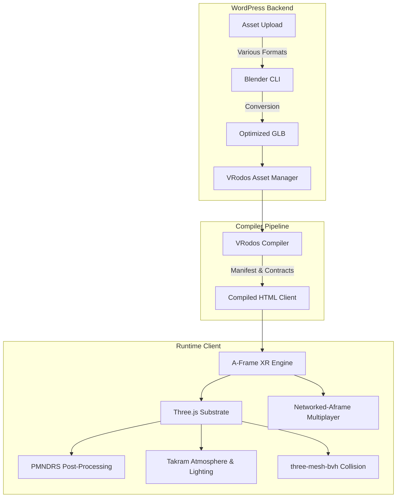

# VRodos Compiled Scene Framework Integration

## Executive Summary

VRodos compiled scenes make [A-Frame](https://github.com/aframevr/aframe), [Three.js](https://github.com/mrdoob/three.js), [PMNDRS](https://github.com/pmndrs/postprocessing), [Takram](https://github.com/takram-design-engineering/three-geospatial), [three-mesh-bvh](https://github.com/gkjohnson/three-mesh-bvh), and [Networked-Aframe](https://github.com/networked-aframe/networked-aframe) work together by avoiding the usual integration traps:

- one compiled `<a-scene>` is the runtime container;
- one shared Three.js runtime is the rendering substrate;
- `scene-settings` is the compatibility contract between compiler output and runtime behavior;
- `assets/runtime-build-manifest.json` controls script order, dependencies, and lazy feature loading;
- focused A-Frame components own lifecycle hooks and delegate to VRodos helpers;
- optional systems such as PMNDRS, Takram atmosphere, BVH collision, FPS tooling, and networking load only when scene metadata requests them.

The result is not several frameworks fighting for the frame. The compiled client is a single A-Frame scene with a carefully planned set of helpers attached to the same renderer, scene graph, material system, loader configuration, and lifecycle.

## The Evolution of Our Architecture

Our current state-of-the-art rendering pipeline is the result of a continuous evolution driven by specific needs. Here is the story of how our architecture came to be:

1. **A-Frame for XR Experiences**: We started with A-Frame because it provides a robust entity-component system (ECS) and excellent out-of-the-box support for immersive WebXR experiences.
2. **Post-Processing with PMNDRS**: We wanted advanced post-processing effects (like bloom, SSAO, tone mapping, and LUTs). Default Three.js and A-Frame did not support these optimally or efficiently, so we integrated **PMNDRS `postprocessing`**, a highly optimized screen-space effects engine.
3. **Dynamic Lighting with Takram**: We needed realistic, dynamic atmospheric lighting—a physical sky, sun, moon, and a day-night cycle. We integrated **Takram**, which provided these capabilities while elegantly sharing our existing Three.js renderer.
4. **Optimized Collisions with BVH**: We required physics and collisions for navigation. Full rigid-body physics engines like Rapier, or custom Three.js raycasting, were too computationally expensive for complex scenes. We adopted **`three-mesh-bvh`**, which massively accelerates static collision queries for walkable navigation.
5. **Multiplayer Collaborative Worlds**: We wanted our worlds to be collaborative and multiplayer. To achieve this, we integrated **Networked-Aframe**, backed by a dedicated Node/WebRTC server (`services/networked-aframe/`). To keep single-player scenes lightweight, multiplayer is an explicit runtime mode that only loads networking components when explicitly requested by the scene's metadata.
6. **On-the-Fly Asset Conversion**: A-Frame natively supports only the `.glb` format for optimal performance. However, our users uploaded assets in various 3D formats (OBJ, FBX, etc.). To solve this, we implemented a server-side **Blender CLI pipeline** to automatically convert all uploaded 3D files into optimized `.glb` format on the fly during the upload process.

### Runtime Architecture Diagram

## 1. One Scene, One Runtime Contract

The compiler emits a real A-Frame scene, not a parallel Three app beside A-Frame. `VRodos_Compiler_Runtime_Page_Builder::apply_scene_core()` applies the scene settings, writes the root `gltf-model` decoder configuration, attaches runtime pipeline components, renders authored objects, and appends compile diagnostics.

The root scene contract has three critical parts:

- `scene-settings`: the compatibility data contract for render quality, navigation, collision mode, post-FX engine, Takram atmosphere controls, reflections, shadows, and diagnostics.
- `gltf-model`: root decoder paths for Draco, Basis/KTX2, and Meshopt so compressed GLB derivatives can load through A-Frame's GLTF loader.
- focused runtime components: `vrodos-render-profile`, `vrodos-postfx-router`, `vrodos-atmosphere`, and `vrodos-reflections`.

## 2. Version And Bundle Source Of Truth

The current compiled runtime stack is declared in the root package files and generated manifests:

- A-Frame runtime: 1.7.1 master commit `63600d331e8eca9bec786bf030bc66040625750b`
- Three.js: `0.181.0`, revision `181`
- PMNDRS `postprocessing`: `6.39.1`, exported as `window.POSTPROCESSING`
- Takram atmosphere packages: atmosphere `0.19.1`, clouds `0.7.6`, geospatial effects `0.6.4`, exported as `window.VRODOS_TAKRAM_ATMOSPHERE`
- `three-mesh-bvh`: `0.9.10`, exported as `window.VRODOS_COLLISION_BVH`

The important architectural rule is that these generated bundles must use A-Frame's `window.THREE`. Compiled scenes must not load a second Three instance beside A-Frame.

## 3. Compile-Time Selection

Runtime scripts are selected by scene metadata, not by hardcoded script tags in the template.

`VRodos_Compiler_Runtime_Script_Planner` starts with required scene components, always adds the core runtime, and then conditionally adds feature-specific chunks. For example, multiplayer is treated as an explicit runtime mode (`networked` vs `single-player`). When networking is enabled in the scene metadata, the planner injects `networked-components` into the compiled client. This ensures that single-player scenes don't pay the overhead of multiplayer components. Other conditionally loaded features include:

- FPS meter when enabled;
- `collision-bvh-vendor` when navigation mode resolves to `walkable`;
- `pmndrs-postfx` when post-FX is enabled and the engine is `pmndrs`;
- `takram-atmosphere` only when PMNDRS atmosphere is enabled;
- `legacy-postfx` when post-FX uses the legacy engine;
- final A-Frame runtime components at the end.

## 4. A-Frame Lifecycle And XR Ownership

A-Frame owns the scene, renderer, camera rig, WebXR presentation mode, entity/component lifecycle, and frame tick.

VRodos uses A-Frame as the orchestration layer:

- `vrodos-render-profile` updates FPS stats and adaptive shadow fitting during `tick()`;
- `vrodos-postfx-router` decides whether legacy post-FX or PMNDRS owns composer behavior;
- `vrodos-atmosphere` updates PMNDRS/Takram sun state and day-night animation;
- `vrodos-reflections` updates HDR, scene-probe, or Takram-sky environment behavior.

## 5. Three.js As The Shared Substrate

Three r181 is the shared low-level substrate under A-Frame and the optional VRodos runtime systems.

Three provides:
- the WebGL renderer used by A-Frame;
- GLTF loading and decoder integration through A-Frame's root `gltf-model` config;
- PMREM processing for HDR environment maps, scene probes, and Takram sky captures;
- material hooks for reflection and direct specular/glint control;
- raycasting used by navigation and collision;
- GPU resource objects that must be disposed through lifecycle cleanup.

PMNDRS, Takram, and BVH work because they attach to this same Three universe. They do not operate on a separate renderer or a separate copy of Three classes.

## 6. PMNDRS Composer And Post-FX Routing

PMNDRS is the modern post-processing path. It is selected per scene through `scene-settings.postFXEngine = pmndrs`.

When active, `window.POSTPROCESSING` provides the PMNDRS composer and effect classes. VRodos builds a scene-specific `EffectComposer` lazily on the first valid render frame. The current PMNDRS order is:

1. `RenderPass`
2. optional `NormalPass` for native SSAO
3. optional standalone Takram sun `LensFlareEffect`
4. primary `EffectPass` for aerial perspective, SSAO, bloom, tone mapping, color, LUT, vignette, and noise
5. optional standalone chromatic aberration
6. optional standalone SMAA
7. screen

## 7. Takram Atmosphere And Lighting Integration

Takram is optional and only loads when PMNDRS atmosphere is enabled. It provides physical sky, sun, moon, celestial, and geospatial atmosphere capabilities through `window.VRODOS_TAKRAM_ATMOSPHERE`.

In compiled Horizon scenes, Takram owns the sky and sun disk. VRodos then bridges that atmosphere into scene lighting:

- Takram `SunDirectionalLight` owns sun key light when available;
- VRodos moon directional light owns night shape when visible;
- `SkyLightProbe`, hemisphere fill, ambient floor, and ground bounce keep GLB surfaces readable;
- day-night changes smooth indirect lighting separately from direct sun/moon movement;
- Takram sky can be captured into PMREM for scene environment reflections.
- direct sun and moon scene lights are horizon-gated, so a celestial body below the local horizon does not continue to illuminate peaks or cast shadows;
- large terrain shadows are kept stable through camera-focused directional shadow fitting, terrain depth offset, and a terrain-specific soft self-shadow shader patch.

## 8. Lighting, Shadows, And Emissive Materials

Lighting in the compiled client is split into separate responsibilities:

- Takram sky and sun disk are visual atmosphere.
- Takram/VRodos directional sun and moon lights provide direct scene lighting and shadows only while above the local horizon threshold.
- `SkyLightProbe`, hemisphere fill, ambient floor, and ground bounce provide indirect readability and move more slowly than direct celestial lights.
- Shadow maps are fitted near the camera for large terrain instead of to the whole scene bounds.
- Terrain that must self-cast uses `terrain-matte` material handling plus custom depth offset and a near-depth soft-shadow lift. This keeps real mountain shadows while avoiding shallow terrain triangle/band artifacts.
- Authored emissive values and media readability emissive boosts are material output only. They do not light neighboring objects, do not cast shadows, and should not be used to replace the sun/moon/indirect-light pipeline.

## 9. BVH Collision And Navigation

Compiled walkable mode uses a native static player/world collision layer inside `custom-movement`. It is not a general rigid-body physics engine.

At runtime, `three-mesh-bvh` patches Three mesh raycasts when available. BVH construction accelerates static collision queries; if BVH creation fails for a mesh, collision falls back to standard Three raycasts.

Movement remains CPU-side geometry work:
- downward sampling finds walkable ground;
- slope, max-step, and max-drop rules keep walking stable;
- multi-height capsule sweep raycasts block horizontal movement;
- axis sliding is attempted when movement hits a blocker.

## 10. XR Compatibility Strategy

Desktop and desktop fullscreen can use the eligible post-FX path. Immersive WebXR is different because stereo rendering and screen-space composer passes are not always safe.

VRodos detects real immersive XR through `renderer.xr.isPresenting`. In immersive XR, unsafe screen-space composer passes can fall back to direct stereo rendering. Scene-owned visuals remain active (Takram sky, scene-owned lights, fog, A-Frame movement). The strategy is to skip unsafe screen-space ownership while preserving scene-owned visual systems.

## 11. Future Features & Roadmap

As we continue to push the boundaries of realism and performance, several advanced features are planned for future integration into our pipeline:

- **Takram Volumetric Clouds & Geospatial Expansion**: Expanding the Takram integration to include volumetric clouds, full geospatial date/time solar simulation, and a realistic physical star layer.
- **WebGPU Migration**: Tracking and following A-Frame's planned r184 upgrade to validate WebGPU as an opt-in experimental renderer, unlocking next-generation performance for complex scenes.
